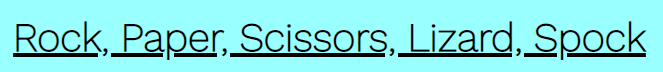

# Rock, Paper, Scissors, Lizard, Spock

Rock, Paper, Scissors, Lizard, Spock, is an adapted version of the game rock paper scissors and was introduced in the popular show the big bang theory.
This game was created because the likelyhood of a draw in rock paper scissors was very high, with the introduction of lizard and spock, a draw is less likey.
By playing this game users will have the choice to choose their option to see if they can beat the computer. This can help with things like decition making.
Whether the user is alone or with friends and family, this game can help them get an answer. The game is fully random so the you`ll never know what the computer is going to pick

//image on different screen sizes

## features

### Existing features

#### Header

- At the top of the website is the title Rock, Paper, Scissors, Lizard, Spock. The title is clear and tells the user what they will find.
- The title is underlined and easy to read. The black writing is clear on the light blue background.

