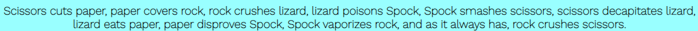
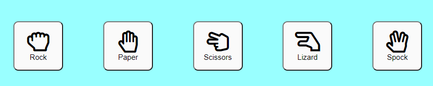
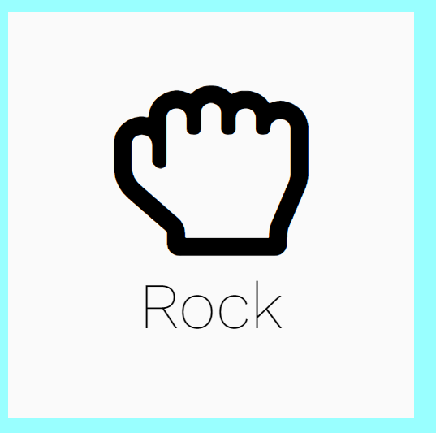
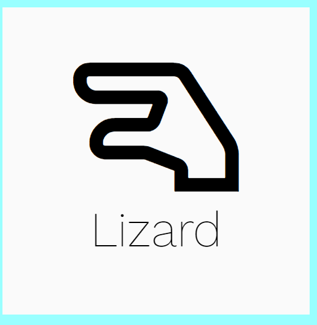
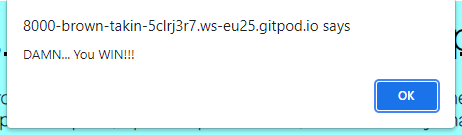
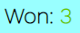
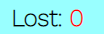
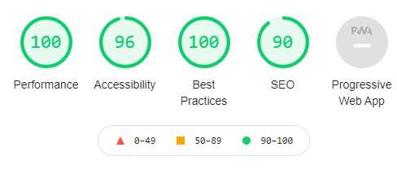

# Rock, Paper, Scissors, Lizard, Spock

Rock, Paper, Scissors, Lizard, Spock, is an adapted version of the game rock paper scissors and was introduced in the popular show the big bang theory.
This game was created because the likelyhood of a draw in rock paper scissors was very high, with the introduction of lizard and spock, a draw is less likey.
By playing this game users will have the choice to choose their option to see if they can beat the computer. This can help with things like decition making.
Whether the user is alone or with friends and family, this game can help them get an answer. The game is fully random so the you`ll never know what the computer is going to pick

## features

### Existing features

#### Header

- At the top of the website is the title Rock, Paper, Scissors, Lizard, Spock. The title is clear and tells the user what they will find.
- The title is underlined and easy to read. The black writing is clear on the light blue background.

#### The Game Rules

- The game rules are a sub heading, by putting the under the titles the user is able to read the rules before starting the game.
- The rules are clear and easy for the user to read.

#### The Game Options

- The game includes 5 options the user can pick from. They have clear labels for the user to understand.
- These options are buttons and allow the user to select their input which will start the game.

#### The preview

- When a user clicks an option their selection will show in the white box on the left.
- The computers choice uses Javascript and is randomised the moment the user has select their option.

 

#### The result

- The user is shown an alert to show if they won or lost, if it is a draw it says snap.
- The score counter will also keep track on how many times the user has won or lost.

 

### Feature left to implement 

- Change alert so that the white box changes to red or green for the user or computer to show who won or lost.

### Testing

- I have tested my game in browsers such as google, google chrome and microsoft edge.
- I can confirm that the game results have been correct everytime.
- I can confirm that all writing in the title, rules, buttons and score are easy to read and understand.
- I can confirm that a clear font was used to help the user read everything with ease and a background color was chosen to help the user use the website with no dificulty.
- i have ran my game through lighthouse to test how user friendly it is.

  ### Bugs

  Currently i have a bug that when the user clicks the icon in the button nothing will happen. The user must click the edge of the button to avoid clicking the icon.

  ### Validator testing

  - I ran my code through the offical WC3 validator and returned no errors.
  - I ran my code through the CSS offical (Jigsaw) validator and returned no errors. 
  - i ran my code through the JShint validator and returned no errors

  ### deployment

  This site was deployed using github pages, this was done by...
  - I went to github and clicked my repostitories, when i found the one i wished to deploy i clicked then went to settings.
  - On the settings pages i found a link to a pages page.
  - From here i had to select source which was main then press save.
  - I was then given a link to my deployed website.

The game is live here... [Rock, Paper, Scissors, Lizard, Spock](https://jharvey125.github.io/project-2/)

### Credits

- The icons used were taken from [fontawesome.com](https://fontawesome.com/v5.15/icons?d=gallery&p=2)

- The question mark images were taken from [transparentpng.com](https://www.transparentpng.com/cats/question-mark-2101.html)

